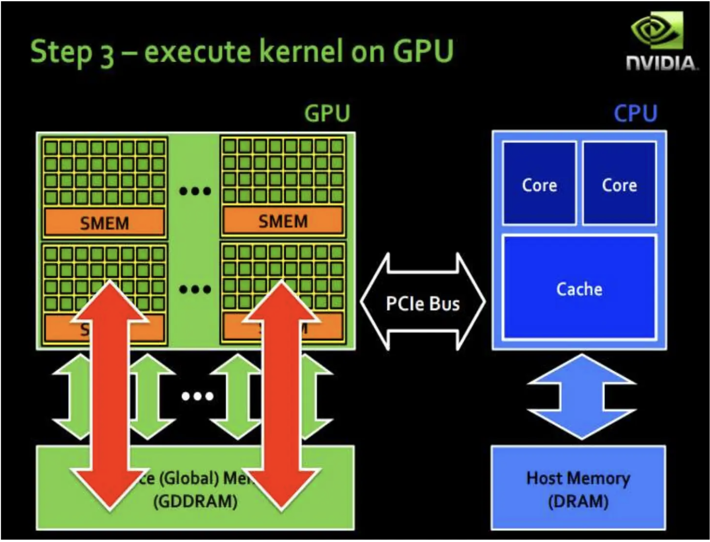
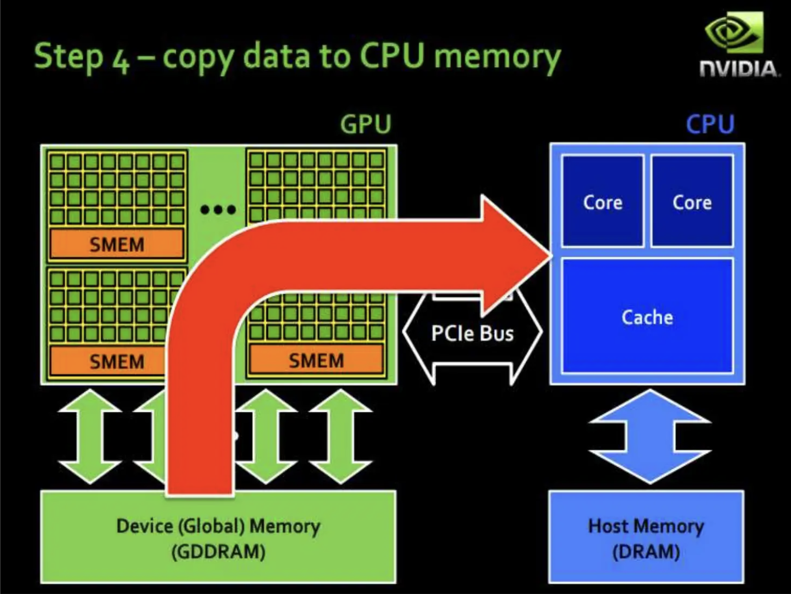

## 模型优化

- Graph: 在不改变模型最终数学逻辑的前提下，通过修改计算流程的“蓝图”（计算图）来提升效率，例如将多个小步骤合并成一个大步骤（算子融合，QKVParallelLinear）。
- Op:专注于将每一个独立的计算步骤（算子，如卷积、加法）本身，用针对特定硬件（如CPU或GPU）最高效的代码来实现（conv2d ➡ matmul）。
- Runtime: 在模型真正执行推理时，通过智能地调度计算任务、管理内存等方式，最大限度地压榨硬件性能，减少等待和浪费（PageAttention, Continuous Batching）。

## AI推理加速（算力，I/O，访存，通信）

- 计算效率：取决于硬件算力，以及计算的持续而不被打断
- 访存效率：取决于访存延迟和带宽
- 计算与访存相重叠
- 计算与通信相重叠

## 模型大小评估指标

1. 计算量 (Computational Cost)
   定义：计算量反映了模型对硬件计算单元的需求。计算量的单位通常是 OPs (Operations) 或 FLOPs (Floating Point Operations)，即浮点运算次数。在深度学习中，最常用的数据格式为 float32，因此 float32 类型下的计算量常被写作 FLOPs。模型的整体计算量等于模型中每个算子的计算量之和。

例子：对两个 shape 为 (N, C, H, W) 的 float32 tensor 进行 add 操作，其计算量为 N×C×H×W FLOPs。

2. 参数量 (Number of Parameters)
   定义：模型中所有需要学习的参数的总和，它直接反映了模型占用的磁盘空间大小。

说明：对于 CNN（卷积神经网络）而言，参数主要由 Conv (卷积) 层和 FC (全连接) 层的 Weight (权重) 构成。其他算子（如 BatchNorm、激活函数等）虽然也可能有参数，但与前者相比通常占比较小。

3. 访存量 (Memory Access)
   定义：指模型计算时所需访问内存/显存的字节大小，它反映了模型对内存/显存带宽的需求。访存量单位为 Bytes，表示模型计算到底需要读取/取多少 Bytes 的数据。

   例子：对两个 shape 为 (N, C, H, W) 的 float32 tensor 进行 add 操作，访存量为 (2+1)×N×C×H×W×sizeof(float32) bytes。其中“2”代表读取两个输入张量，“1”代表写入一个输出张量。
4. (峰值)内存占用 (Peak Memory Usage)

- 定义：指模型跑起来的时候（训练或推理）所占用的内存/显存大小。峰值内存占用，特指在运行过程中的内存/显存占用的峰值。注意：内存占用 ≠ 访存量。
- 峰值内存占用的特征描述：

  - 动态性 (Dynamic)：峰值内存是一个动态指标，它在模型单次迭代（iteration）的执行过程中是不断变化的。如上图所示，内存在前向传播（forward）阶段通常会持续增长，在反向传播（backward）阶段会因为部分中间变量被释放而有所波动和下降。
  - 综合性 (Comprehensive)：它不仅包括模型本身的参数（权重），还包括训练或推理过程中产生的中间激活值（feature maps）、计算出的梯度（在训练时），以及优化器（Optimizer）自身的状态（如动量信息）等。
  - 训练远高于推理：通常情况下，模型训练时的峰值内存占用远大于推理时。这是因为训练需要保存前向传播过程中的所有中间激活值，以便在反向传播时计算梯度，同时还要存储梯度本身和优化器的状态。而推理过程通常只需要保留前一层的输出供后一层使用，可以做到“阅后即焚”。
  - 非简单叠加：峰值内存并不是所有张量（参数、激活值、梯度）大小的简单相加。现代深度学习框架有高效的内存管理机制，会复用内存空间。峰值内存反映的是在某一特定时刻，同时存在于内存/显存中的所有张量的总大小的最大值。

## 模型中常见的量化算子

模型量化并非对所有算子都一视同仁，它主要针对那些计算密集且能量消耗大的算子，以及那些容易用整数运算来模拟的算子。

以下是常见的、可以被有效量化的算子类型，我将它们分为几类以便于理解。

#### 1. 核心计算密集型算子 (Compute-Intensive Operators)

这类算子是量化的**最主要目标**，因为它们占据了模型大部分的计算时间。将它们从浮点运算转换为整数运算，能带来最大的性能提升。

* **卷积类 (Convolutions)**
  * `Conv2D` (二维卷积)
  * `DepthwiseConv2D` (深度可分离卷积)
  * `Conv3D` (三维卷积)
  * `ConvTranspose2D` (转置卷积 / 反卷积)
* **全连接/线性类 (Fully-Connected / Linear)**
  * `MatMul` (矩阵乘法)
  * `FullyConnected` / `Linear` (全连接层)
  * `BatchMatMul` (批量矩阵乘法)

这些算子的核心都是大量的乘法-累加（Multiply-Accumulate, MAC）操作，非常适合在硬件上用高效的整数指令集来执行。

#### 2. 逐元素操作算子 (Element-wise Operations)

这类算子对张量的每个元素进行独立操作，通常也易于量化。

* **基础算术**: `Add` (加法), `Mul` (乘法), `Sub` (减法)
  * *注意*: 对两个量化张量进行这些操作时，通常要求它们的量化参数（scale和zero-point）兼容或需要进行额外的重量化（Requantization）步骤。
* **比较**: `Maximum`, `Minimum`

#### 3. 激活函数 (Activation Functions)

激活函数的量化分为两种情况：

* **易于量化的激活函数**:
  * `ReLU`: `max(0, x)`，在整数域非常容易实现。
  * `ReLU6`: `min(max(0, x), 6)`，同样是简单的比较和裁剪操作。
  * `LeakyReLU` 及其他 PReLU、ReLU 的变体。
* **较难量化的激活函数**:
  * `Sigmoid`
  * `Tanh`
  * `Swish` / `SiLU`
  * `GeLU`
  * 这些函数是非线性的，并且形状复杂。在量化时，通常使用**查找表 (Look-up Table, LUT)** 或者分段多项式逼近的方法来模拟它们的行为，会引入一定的精度误差。

#### 4. 池化和塑形算子 (Pooling and Shaping Operators)

* **池化类 (Pooling)**:
  * `MaxPool` (最大池化)
  * `AveragePool` (平均池化)
  * `GlobalAveragePool` (全局平均池化)
* **数据塑形/重排类 (Shaping / Reordering)**:
  * `Concat` (拼接)：通常要求待拼接的张量有相同的量化参数。
  * `Reshape` (重塑形状)
  * `Transpose` (转置)
  * `Squeeze` / `Unsqueeze` (维度压缩/扩展)
  * `Pad` (填充)
  * `Slice` / `Split` (切分)

#### 5. 归一化算子 (Normalization Operators)

* **批归一化 (Batch Normalization)**: `BatchNorm` 本身在推理时**不会被直接量化**。它是一个线性变换，因此在部署前，它的参数（均值、方差、gamma、beta）会被数学上**“折叠”或“融合”（Fuse）**到前一层的卷积或全连接层的权重和偏置中。您上一张图中就展示了这个过程。
* **其他归一化**:
  * `LayerNorm`, `InstanceNorm`: 这些比 `BatchNorm` 更难处理，因为它们的归一化统计量是动态计算的，量化起来更复杂，有时为了精度会被保留为浮点计算。

### 总结


| 类别             | 常见算子                       | 量化友好度                  |
| :----------------- | :------------------------------- | :---------------------------- |
| **计算密集型**   | `Conv2D`, `MatMul`, `Linear`   | **高 (主要目标)**           |
| **激活函数**     | `ReLU`, `ReLU6`                | **高**                      |
|                  | `Sigmoid`, `Tanh`, `Swish`     | 中 (需要查找表或近似)       |
| **池化与塑形**   | `MaxPool`, `AvgPool`, `Concat` | 高                          |
| **逐元素操作**   | `Add`, `Mul`                   | 高 (需注意量化参数)         |
| **归一化**       | `BatchNorm`                    | **高 (通过融合实现)**       |
|                  | `LayerNorm`                    | 低 (通常保持浮点)           |
| **其他复杂函数** | `Softmax`, `exp`, `log`, `pow` | 低 (通常保持浮点或用查找表) |

总而言之，一个模型中绝大多数的算子都可以被量化，但核心收益来自于对**卷积和全连接层**的量化。对于复杂的非线性函数，则需要在性能和精度之间做出权衡。不同的量化框架（如 TensorFlow Lite, TensorRT, PyTorch Quantization）和目标硬件支持的算子列表也会略有不同。

好的，这是为您整理的图片中的内容：

## **CUDA 程序中的修饰符**

这些修饰符用于指定函数在何种处理器（CPU 或 GPU）上执行和被调用。

1. **`__global__`**

   * **说明**：这是一个 CUDA 核函数 (Kernel) 的前缀。
   * **调用与执行**：该函数由 **CPU (主机端)** 调用启动，在 **GPU (设备端)** 上执行。
2. **`__host__`**

   * **说明**：表示一个主机端函数。
   * **调用与执行**：该函数由 **CPU (主机端)** 调用，并在 **CPU (主机端)** 上执行。
   * **注意**：正常的 C++ 函数如果没有加任何修饰符，默认就是 `__host__` 函数。
3. **`__device__`**

   * **说明**：表示一个设备端函数。
   * **调用与执行**：该函数只能被 **GPU (设备端)** 调用（通常由 `__global__` 函数或其他 `__device__` 函数调用），并在 **GPU (设备端)** 上执行。

---

### **组合使用**

* `__host__` 和 `__device__` 可以一起使用，表示该函数既可以被 CPU 调用并在 CPU 上运行，也可以被 GPU 调用并在 GPU 上运行。编译器会为这份代码生成两个版本。

  **示例**:

  ```cpp
  __host__ __device__ int run_on_cpu_or_gpu() {
      return 1;
  }
  ```

---

### **内联修饰符**

这些修饰符向编译器提供关于函数内联（inline）的指令。

4. **`__noinline__`**

   * **说明**：强制编译器**不要**将该函数进行内联展开。
5. **`__forceinline__`**

   * **说明**：强制编译器**必须**将该函数进行内联展开。
   * **注意**：`__forceinline__` 通常与 `__device__` 一起使用，以优化设备端代码的性能。

您说得对，我确实遗漏了图片中关于**60%利用率**这个重要的图示信息。这个阈值可以作为判断Kernel类型的直观标准。

这是修正和补充后的版本：

## **CUDA Kernel 的三大瓶颈类型**

1. **计算密集型 (Compute Bound)**

   * **判定**:
     * **公式**:
       $$
       \frac{\text{计算量}}{\text{访存量}} > \frac{\text{GPU峰值算力}}{\text{GPU峰值带宽}}

       $$
     * **图示**: 计算单元利用率 (Comp) **> 60%**，而访存利用率 (Mem) 较低。
   * **瓶颈**: 性能受限于GPU的算术运算速度。
   * **例子**: 大规模矩阵乘法 (gemm)、卷积 (conv)。
2. **访存密集型 (Memory Bound)**

   * **判定**:
     * **公式**:
       $$
       \frac{\text{计算量}}{\text{访存量}} < \frac{\text{GPU峰值算力}}{\text{GPU峰值带宽}}

       $$
     * **图示**: 访存利用率 (Mem) **> 60%**，而计算单元利用率 (Comp) 较低。
   * **瓶颈**: 性能受限于从显存读写数据的速度（带宽）。
   * **例子**: ReLU、数组拼接 (concat)。
3. **延迟密集型 (Latency Bound)**

   * **判定**:
     * **图示**: 计算 (Comp) 和访存 (Mem) 的利用率**均远低于 60%**。
   * **瓶颈**: 性能受限于指令依赖、同步或数据规模过小导致的流水线停顿。
   * **例子**: 未经优化的、或处理小尺寸数据 (small shape) 的 Kernel。

## **CUDA 计算流程**

```
#include <stdio.h>
#include <cuda.h>
#include <cuda_runtime.h>

__global__ void sum(float *x)
{
    // 泛指当前block在所有block范围内的id
    int block_id = blockIdx.x;
    // 泛指当前线程在所有block范围内的全局id
    int global_tid = blockIdx.x * blockDim.x + threadIdx.x;
    // 泛指当前线程在其block内的id
    int local_tid = threadIdx.x;
    printf("current block=%d, thread id in current block =%d, global thread id=%d\n", block_id, local_tid, global_tid);
    x[global_tid] += 1;
}

int main(){
    int N = 32;
    int nbytes = N * sizeof(float);
    float *dx, *hx;
    /* allocate GPU mem */
    cudaMalloc((void **)&dx, nbytes);//思考为什么要用二级指针
    /* allocate CPU mem */
    hx = (float*) malloc(nbytes);
    /* init host data */
    printf("hx original: \n");
    for (int i = 0; i < N; i++) {
        hx[i] = i;
        printf("%g\n", hx[i]);
    }
    /* copy data to GPU */
    cudaMemcpy(dx, hx, nbytes, cudaMemcpyHostToDevice);
    /* launch GPU kernel */
    sum<<<1, N>>>(dx);
    /* copy data from GPU */
    cudaMemcpy(hx, dx, nbytes, cudaMemcpyDeviceToHost);
    printf("hx current: \n");
    for (int i = 0; i < N; i++) {
        printf("%g\n", hx[i]);
    }
    cudaFree(dx);
    free(hx);
    return 0;
}
```






